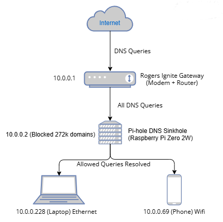
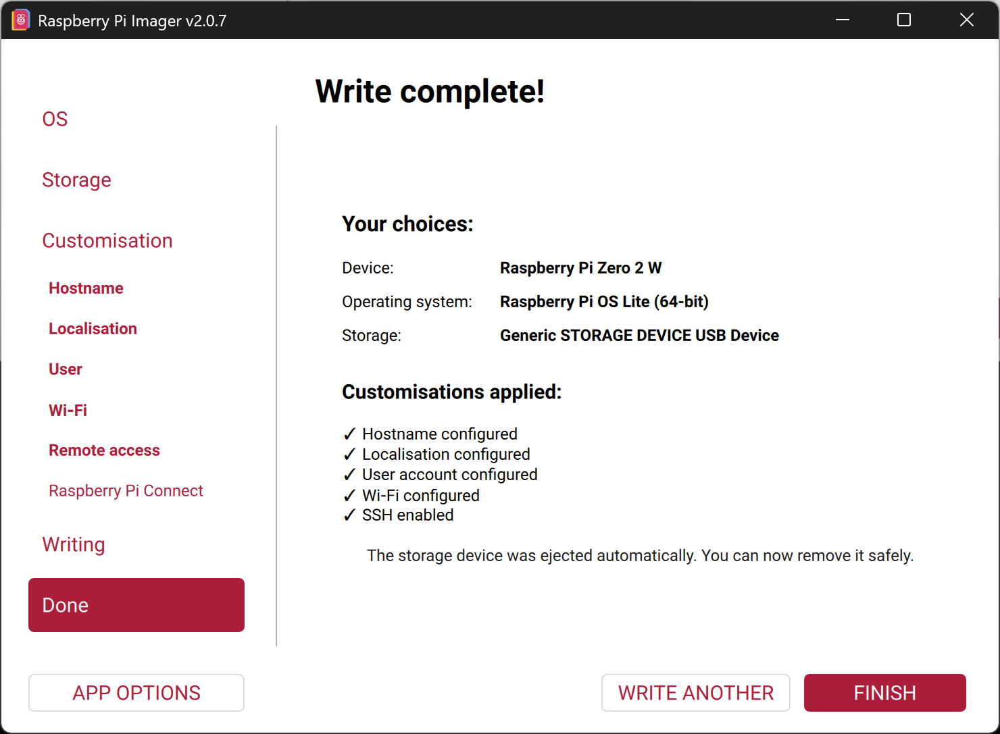
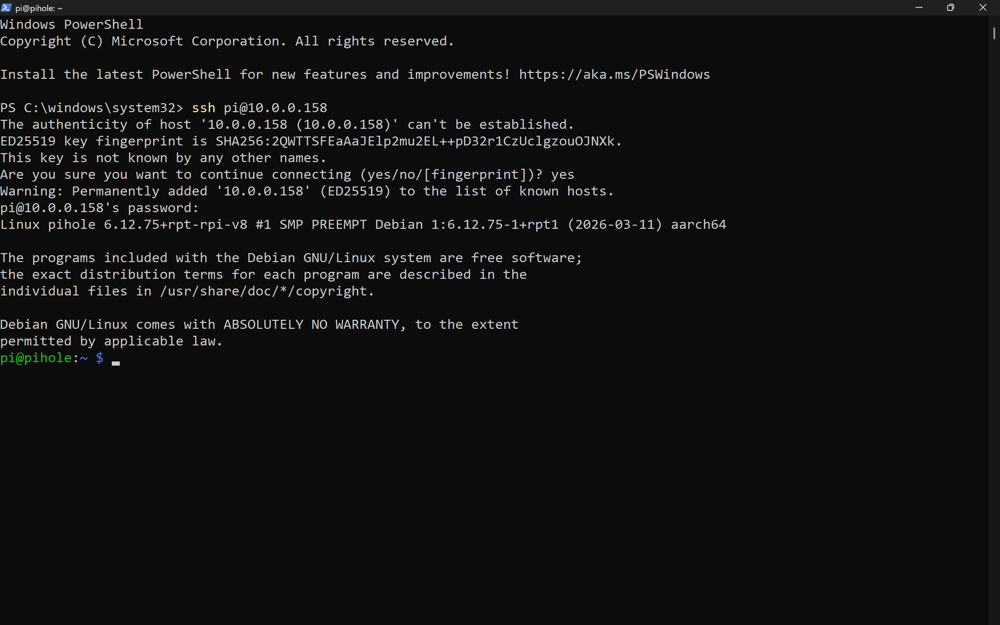
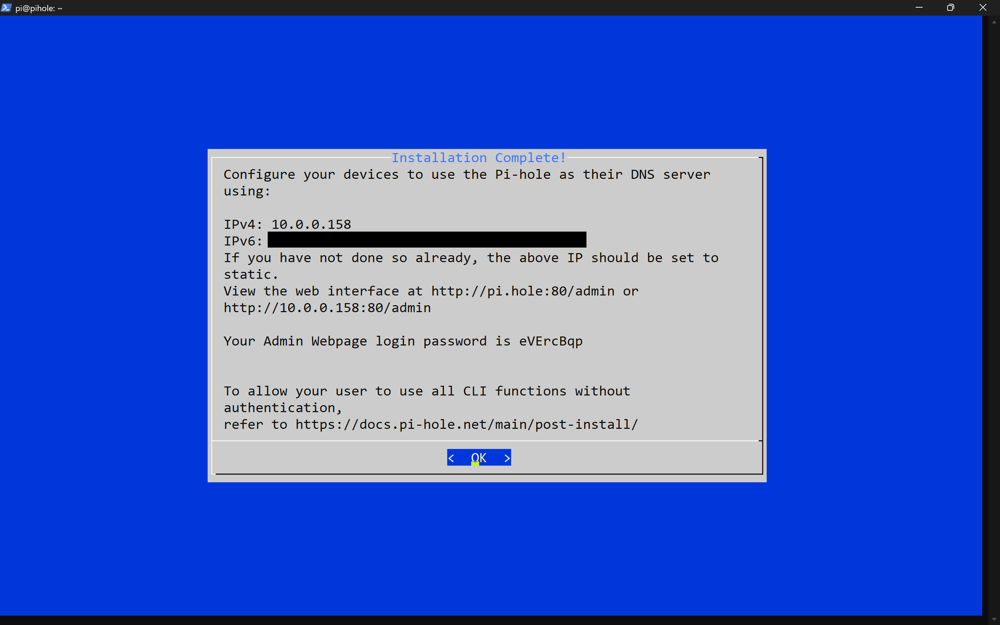
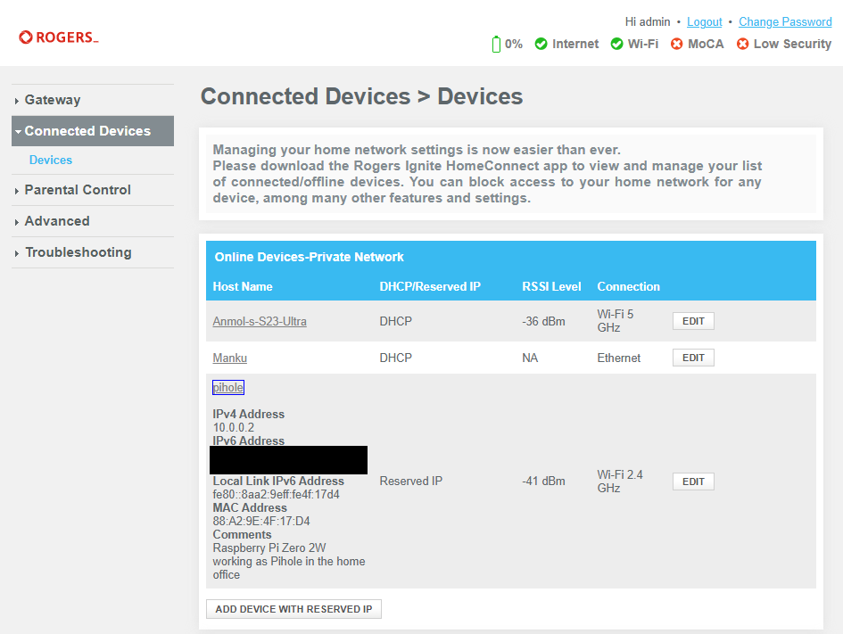
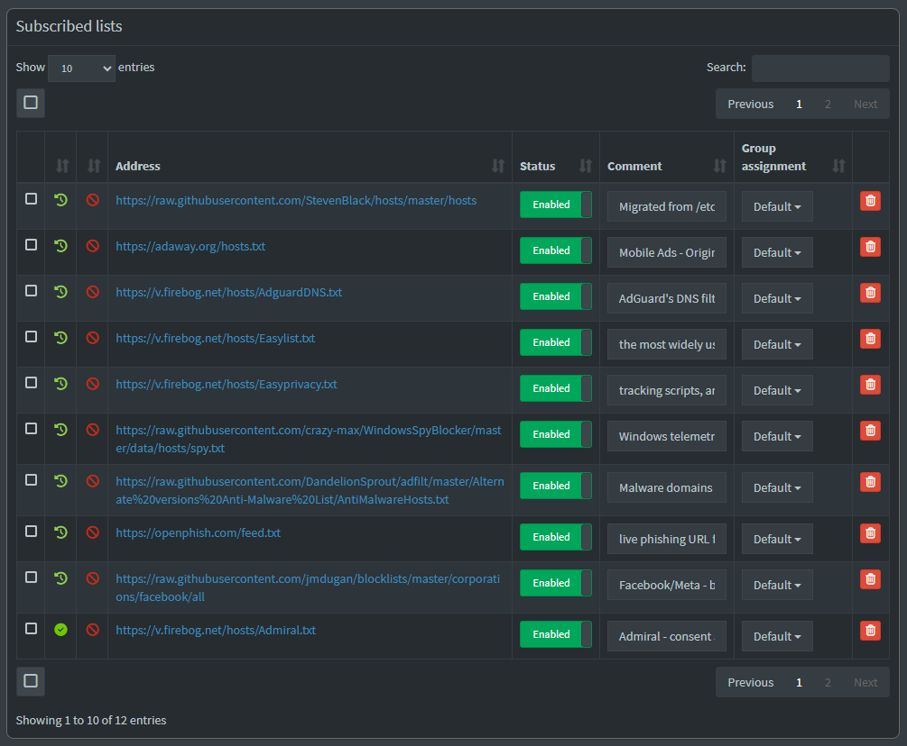
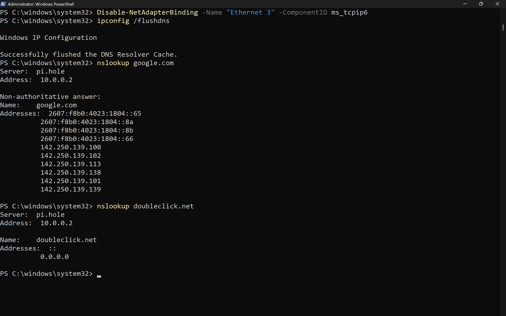

# Pi-hole DNS Sinkhole: Network-Wide Ad and Tracker Blocking

This project deploys Pi-hole on a Raspberry Pi Zero 2W as a network-wide DNS sinkhole, blocking ads, trackers, telemetry, phishing domains, and malware across all devices without installing any software on them.

Built as part of a home lab environment alongside an Active Directory domain and Proxmox VE hypervisor.

## What This Project Demonstrates

- Deploying Raspberry Pi OS Lite (64-bit) headlessly using Raspberry Pi Imager
- Configuring Wi-Fi and SSH pre-boot for headless access
- Installing and configuring Pi-hole as a DNS sinkhole
- Reserving a static IP via DHCP on a Rogers Ignite gateway
- Configuring multiple curated blocklists for ads, tracking, telemetry, malware, and phishing
- Resolving IPv6 DNS override issues on Windows to enforce Pi-hole usage
- Manually configuring per-device DNS on a locked-down ISP router

## Technologies Used

- Raspberry Pi Zero 2W
- Raspberry Pi OS Lite (64-bit, Debian-based)
- Pi-hole (DNS sinkhole and web dashboard)
- Cloudflare DNS (1.1.1.1) as upstream resolver
- Rogers Ignite Gateway (DHCP reservation)
- SSH (headless administration)
- PowerShell (Windows DNS configuration and troubleshooting)

## Network Diagram

<!-- TODO: Add network diagram image -->
<!--  -->

| Device | Hostname | IP Address | Role |
|--------|----------|------------|------|
| Raspberry Pi Zero 2W | pihole | 10.0.0.2 | DNS Sinkhole (Pi-hole) |
| Rogers Ignite Gateway | — | 10.0.0.1 | Router, DHCP Server |
| Windows Laptop | Manku | 10.0.0.228 | Primary workstation |

- Network: `10.0.0.0/24` (Home Wi-Fi and Ethernet)
- Upstream DNS: Cloudflare `1.1.1.1`
- Pi-hole Admin Dashboard: `http://10.0.0.2/admin`

## Configuration Steps

### 1. Raspberry Pi OS Setup

- Downloaded Raspberry Pi Imager on Windows
- Flashed Raspberry Pi OS Lite (64-bit) onto a 64GB microSD card
- Configured hostname (`pihole`), username (`pi`), Wi-Fi credentials, and SSH during flashing using the OS customisation menu
- Inserted microSD into Pi Zero 2W and powered it via micro USB

<!--  -->

### 2. First Boot and SSH Access

- Waited 90 seconds for first boot to complete
- Found the Pi's IP address in the Rogers gateway device list
- Connected via SSH from PowerShell: `ssh pi@10.0.0.2`
- Ran `sudo apt update && sudo apt upgrade -y` before proceeding

<!--  -->

### 3. Pi-hole Installation

- Installed Pi-hole using the official one-line installer:
  ```bash
  curl -sSL https://install.pi-hole.net | bash
  ```
- Selected Cloudflare (1.1.1.1) as the upstream DNS provider
- Enabled query logging and set privacy mode to "Show everything"
- Web admin interface installed automatically

<!--  -->

### 4. Static IP Reservation

- Logged into Rogers Ignite Gateway at `10.0.0.1`
- Created a DHCP reservation for the Pi's MAC address (`88:A2:9E:4F:17:D4`)
- Assigned static IP: `10.0.0.2`
- Added comment: "Raspberry Pi Zero 2W working as Pihole in the home office"

<!--  -->

### 5. Blocklists Configuration

Added 12 curated blocklists via the Pi-hole admin dashboard:

| List | Purpose |
|------|---------|
| StevenBlack/hosts | General ads and malware (default combined hosts list) |
| adaway.org/hosts.txt | Mobile ads (originally built for Android) |
| Firebog AdguardDNS | AdGuard's DNS filter for ads and tracking across web and apps |
| Firebog Easylist | EasyList (most widely used ad blocking filter) |
| Firebog Easyprivacy | Tracking scripts, analytics, and data collection |
| WindowsSpyBlocker spy.txt | Microsoft and Windows telemetry domains |
| AntiMalwareHosts.txt | Known malware distribution sites |
| OpenPhish feed.txt | Live phishing URL feed (updates frequently) |
| jmdugan/facebook/all | Facebook and Meta tracking and data collection |
| Firebog Admiral | Admiral consent and ad management tracking |
| Firebog Prigent-Ads | Prigent ads and tracking domains |
| adblock-nocoin-list | Browser-based cryptomining scripts |

Total domains blocked after deduplication: **272,293**

Ran `Update Gravity` after adding all lists to rebuild the blocklist database.

<!--  -->
<!--  -->

### 6. DNS Configuration on Devices

- Set Preferred DNS to `10.0.0.2` and Alternate DNS to `1.1.1.1` in Windows Ethernet adapter settings

**Issue encountered:** Windows continued using Rogers IPv6 DNS servers, which appeared first in the DNS resolution order, bypassing Pi-hole entirely.

**Diagnosis:**
- Ran `Get-DnsClientServerAddress` in PowerShell to reveal all DNS entries per adapter
- Rogers Ignite Gateway pushes IPv6 DNS via DHCPv6 automatically and does not allow changing DNS settings in the router admin panel

**Fix:**
- Disabled IPv6 on the Ethernet adapter to prevent Rogers IPv6 DNS from overriding Pi-hole:
  ```powershell
  Disable-NetAdapterBinding -Name "Ethernet 3" -ComponentID ms_tcpip6
  ```
- Flushed DNS cache: `ipconfig /flushdns`

**Verification:**
- Ran `nslookup google.com` and confirmed `Server: 10.0.0.2`
- Ran `nslookup doubleclick.net` and confirmed the domain was blocked (returned `0.0.0.0`)

<!--  -->

## Results

| Metric | Value |
|--------|-------|
| Domains on blocklist | 272,293 |
| Blocklists active | 12 |
| Upstream DNS | Cloudflare 1.1.1.1 |
| Hardware cost | ~$15 CAD (Raspberry Pi Zero 2W) |
| Power consumption | ~0.5W idle |
| Software installed on clients | None |

## Lessons Learned

- Gained hands-on experience with DNS at the network level. Understanding how DNS resolution order works (IPv6 before IPv4) was critical to diagnosing why Pi-hole was being bypassed
- Learned that ISP-provided routers like the Rogers Ignite Gateway often lock down DNS settings, requiring workarounds like per-device configuration or adding your own router in bridge mode
- Understood the value of DHCP reservations for infrastructure devices. A DNS server with a dynamic IP defeats the purpose
- Learned to use `Get-DnsClientServerAddress` and `ipconfig /all` as diagnostic tools to trace exactly where DNS queries are going
- Reinforced the importance of documenting troubleshooting steps, not just successful outcomes. The IPv6 DNS override issue was the most valuable learning moment in this project

## Next Steps

- [ ] Install Tailscale on the Pi for remote dashboard access and SSH
- [ ] Add a dedicated router (bridge mode on Rogers gateway) for true network-wide DNS without per-device config
- [ ] Block adult content categories via Pi-hole regex and blocklists
- [ ] Explore Pi-hole's DHCP server to fully replace router DHCP
- [ ] Create a network diagram including all lab devices (Proxmox, AD domain, Pi-hole)

## Related Projects

- [Active Directory Lab](https://github.com/anmolmanku/active-directory-project) — Windows Server 2022 domain controller with OUs, users, security groups, and GPOs